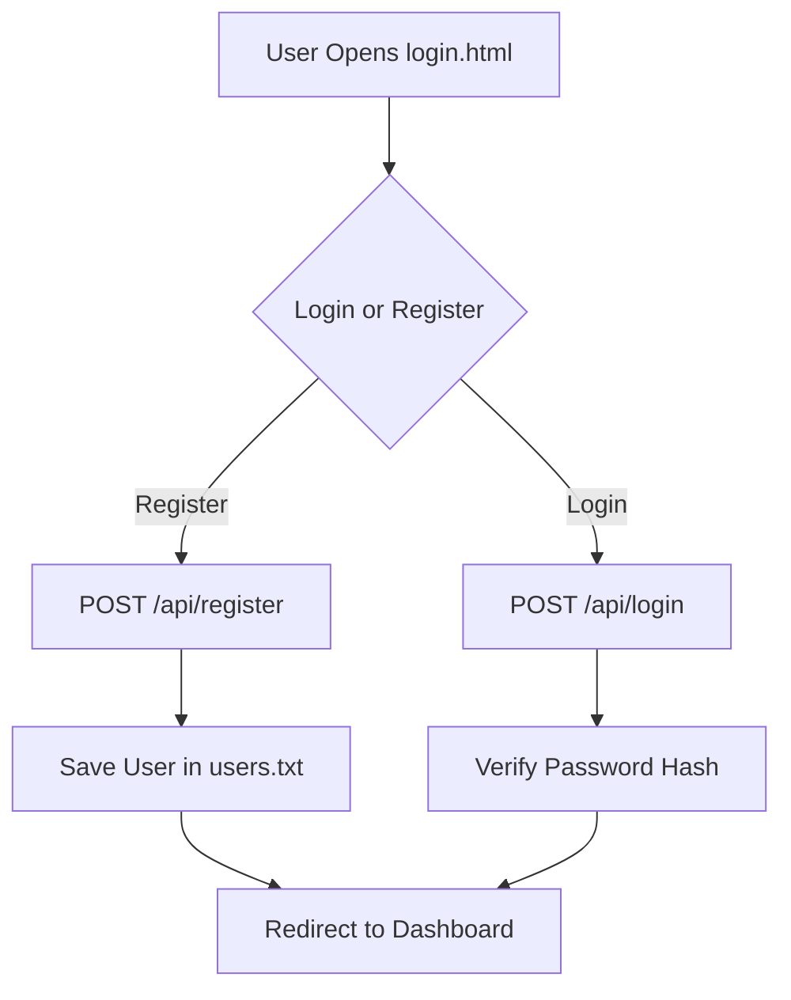
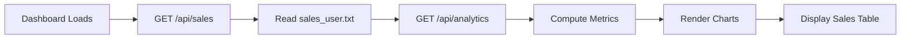
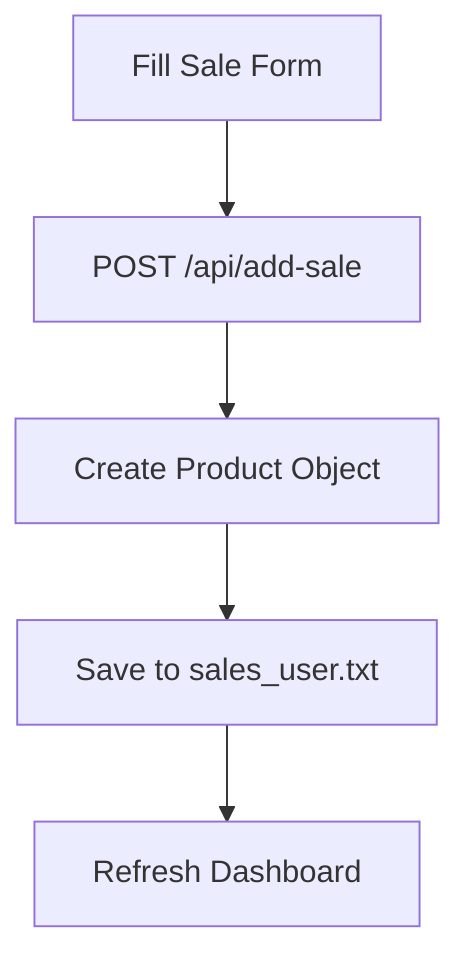
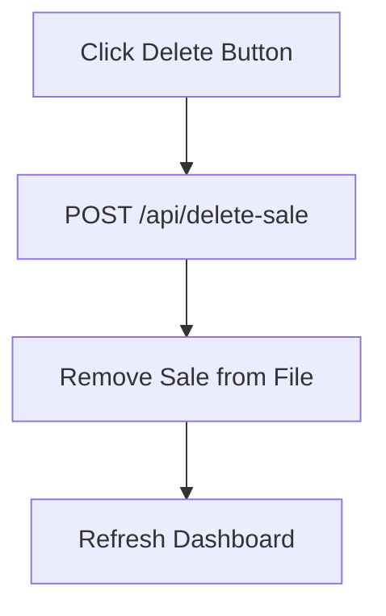
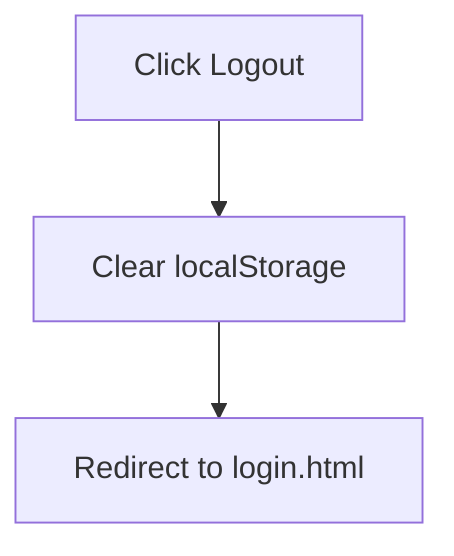

📊 Sales Analytics Dashboard

A full-stack sales tracking and analytics system with secure user authentication, persistent storage, and interactive data visualizations.

🎯 Project Overview

Sales Analytics Dashboard helps businesses track and analyze their sales data with personalized insights such as:

Top-selling products

Peak sales hours

Monthly revenue trends

Category-wise performance

This project is designed for academic submission, practical demonstration, and real-world learning.

✨ Key Features

✅ User Registration & Login (Secure Authentication)

✅ Add, View, and Delete Sales Transactions

✅ Real-time Analytics Dashboard

✅ 5 Interactive Charts (Chart.js)

✅ Persistent File-Based Storage

✅ Responsive Modern UI

🏗️ Project Structure
## 🏗️ Project Structure

```text
project-root/
│
├── backend/
│   ├── User.java              # User model & authentication
│   ├── Product.java           # Sales transaction model
│   ├── Database.java          # File-based storage
│   ├── SalesAnalytics.java    # Analytics calculations
│   ├── AuthService.java       # Login/Register service
│   ├── Resource.java          # REST API endpoints
│   └── Main.java              # Server entry point
│
├── frontend/
│   ├── login.html             # Login & registration UI
│   ├── dashboard.html         # Analytics dashboard
│   ├── login.js               # Authentication logic
│   ├── dashboard.js           # Dashboard & charts logic
│   └── style.css              # Styling
│
└── data/
    ├── users.txt              # Stored user credentials
    └── sales_[username].txt   # User-specific sales data


🔄 System Workflow



📊 Dashboard Operations



➕ Add New Sale Flow


🗑️ Delete Sale Flow



🔐 Logout Flow


📈 Analytics & Metrics

The dashboard displays:

Total Revenue

Total Sales Count

Top-Selling Product

Best Performing Month

Peak Sales Hour

Highest Single Sale

Charts Included:

📊 Top Products (Bar Chart)

📉 Monthly Sales Trend (Line Chart)

🥧 Category Distribution (Pie Chart)

📊 Hourly Sales (Bar Chart)

📊 Least Selling Products (Bar Chart)

🛠️ Technology Stack

Layer	Technology
Backend	Java (JDK 11+), Built-in HTTP Server
Frontend	HTML5, CSS3, Vanilla JavaScript
Charts	Chart.js 4.4.0
Storage	File-based (.txt files)
Security	SHA-256 Password Hashing
API	REST (JSON)

⚙️ Algorithms Used

Operation	Algorithm	Time Complexity
Sorting Sales	Merge / Tim Sort	O(n log n)
Grouping Data	HashMap Aggregation	O(n)
Top-K Products	Min-Heap	O(n log k)
Analytics Metrics	Single Pass	O(n)

📋 Prerequisites
Java

JDK 11 or higher

Verify installation:

java -version
javac -version

Browser

Chrome / Firefox / Edge / Safari

IDE (Optional)

VS Code

IntelliJ IDEA

Eclipse

▶️ How to Run the Project
Backend
cd backend
javac *.java
java Main

Frontend

Open frontend/login.html in browser

🎓 Academic Relevance

This project is ideal for:

DAA / Data Analytics Mini Project

Final Year / Semester Project

Practical & Viva Demonstration

🚀 Future Enhancements

Database integration (MySQL / MongoDB)

JWT-based authentication

Cloud deployment

Role-based access control

Export analytics as PDF

📌 Conclusion

The Sales Analytics Dashboard provides a complete, secure, and scalable solution for analyzing sales data while demonstrating strong concepts in:

Data Structures & Algorithms

Backend API Design

Frontend Visualization

File Handling & Security

✅ END OF README
